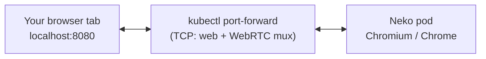

# chrome-in-a-box

A self-hosted, **isolated** web browser that runs in a container and that you
drive straight from your own browser tab — no VNC or RDP client, just a URL.
Built on [Neko](https://github.com/m1k1o/neko), deployed with **Helm** to a
**local** Kubernetes cluster (minikube).

Handy for a clean, disposable browser profile that keeps its own logins and
saved passwords, fully sandboxed from your host and everything else you run.

## How it works



The browser renders inside the pod; Neko streams it to your tab over WebRTC.
Media is carried over a **single TCP port** (`NEKO_WEBRTC_TCPMUX`) so it works
through `kubectl port-forward`, which cannot forward the usual UDP media range.

## Requirements

- [minikube](https://minikube.sigs.k8s.io/), [helm](https://helm.sh/) and `kubectl`
- A container/VM driver for minikube (`podman` by default; override with `DRIVER=`)

The cluster is a **dedicated local minikube profile** (`chrome-in-a-box`). It is
created just for this and never touches any other kube-context you have set.

## Quick start

```bash
./run.sh up          # start local minikube + helm upgrade --install
./run.sh forward     # port-forward to localhost (foreground, Ctrl-C to stop)
./run.sh open        # open http://localhost:8080
# log in with user "neko" / password "neko"
```

Tear down:

```bash
./run.sh down        # helm uninstall (keeps the cluster)
./run.sh nuke        # delete the whole local minikube profile
```

Prefer raw tools? `helm upgrade --install chrome-in-a-box charts/chrome-in-a-box`
then `kubectl port-forward svc/chrome-in-a-box 8080:8080 8081:8081`.

## Browser flavours

| Flavour        | Value                    | Arch          | Google account sync | Speed on Apple Silicon |
| -------------- | ------------------------ | ------------- | ------------------- | ---------------------- |
| **chromium**   | `image.tag=chromium`     | arm64 + amd64 | no                  | native, fast (default) |
| google-chrome  | `image.tag=google-chrome`| amd64 only    | yes                 | emulated, slower       |

Chromium is native and fast and saves passwords locally. Google Chrome adds
Google account sync but ships amd64-only, so on ARM it runs emulated. Switch with
`BROWSER=google-chrome ./run.sh up` or `--set image.tag=google-chrome`.

## Build & automation

Everything is published to GitHub Container Registry from CI:

- **Image** — `ghcr.io/sapn95/chrome-in-a-box` (`:chromium` multi-arch, `:google-chrome` amd64),
  built on push, on `v*` tags, and **weekly** so the upstream base stays fresh.
- **Chart** — `oci://ghcr.io/sapn95/charts/chrome-in-a-box`, packaged and pushed on release.
- **CI** — hadolint, ShellCheck, yamllint, `helm lint`/`template`, `bats`, and an
  image smoke test (build → run → health-check the web UI).
- **Renovate** keeps the base image, chart values and GitHub Actions up to date,
  auto-merging low-risk updates.

Install the hooks locally with `pre-commit install`.

## Base image

This image layers thin defaults on top of the upstream Neko browser images
(Debian-based). It intentionally tracks the flavour tag (e.g. `:chromium`); the
weekly rebuild refreshes it rather than pinning a digest, because the base is
selected at build time via the `BROWSER` build-arg.

## Credits & licence

- Browser streaming by [Neko](https://github.com/m1k1o/neko) (Apache-2.0).
- This wrapper is licensed under the [MIT licence](LICENSE).
